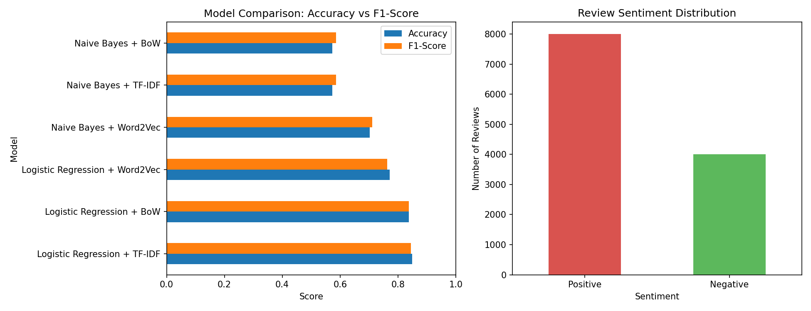

# Kindle Sentimental Analysis

Sentiment analysis on Amazon Kindle book reviews. Reviews are cleaned and
lemmatized, turned into features three different ways (Bag of Words,
TF-IDF, Word2Vec), and used to train and compare Naive Bayes and Logistic
Regression classifiers for predicting whether a review is positive or
negative.

## Dataset

`all_kindle_review.csv` — ~12,000 Amazon Kindle reviews with columns
including `reviewText`, `rating`, `summary`, `reviewTime`, `reviewerID`,
and `asin`. Ratings are binarized for this task: **1–2 stars → negative
(0)**, **3–5 stars → positive (1)**.

## Pipeline

1. **Preprocessing** — keep `reviewText` and `rating`, lowercase text,
   strip URLs/HTML/punctuation/special characters, remove stopwords
   (NLTK), lemmatize (WordNet).
2. **Train/test split** — 80/20 via `sklearn.model_selection.train_test_split`.
3. **Feature extraction** — three representations built independently:
   - Bag of Words (`CountVectorizer`)
   - TF-IDF (`TfidfVectorizer`)
   - Word2Vec (`gensim`, averaged word vectors per review)
4. **Models** — Gaussian Naive Bayes and Logistic Regression, trained on
   each feature representation (6 model/feature combinations total).
5. **Evaluation** — accuracy, precision, recall, and F1 (weighted) via
   `classification_report`.
6. **Visualization** — bar chart comparing all six models plus the
   review rating class balance, saved as `model_comparison.png`.

All of this lives in `Kindle_Review.ipynb`.

## Results

| Model | Accuracy | Precision | Recall | F1-Score |
|---|---|---|---|---|
| Logistic Regression + TF-IDF | 0.850 | 0.848 | 0.850 | 0.845 |
| Logistic Regression + BoW | 0.838 | 0.837 | 0.838 | 0.837 |
| Logistic Regression + Word2Vec | 0.772 | 0.764 | 0.772 | 0.762 |
| Naive Bayes + Word2Vec | 0.702 | 0.750 | 0.702 | 0.712 |
| Naive Bayes + TF-IDF | 0.573 | 0.643 | 0.573 | 0.586 |
| Naive Bayes + BoW | 0.573 | 0.647 | 0.573 | 0.586 |

**Logistic Regression + TF-IDF** is the best-performing combination.



## Setup

Requires Python 3.10+.

```bash
git clone git@github.com:SyedAyaanAli6786/Kindle-Sentimental-Analysis.git
cd Kindle-Sentimental-Analysis

python3 -m venv venv
source venv/bin/activate      # Windows: venv\Scripts\activate

pip install -r requirements.txt
```

The notebook downloads the NLTK `stopwords` and `wordnet` corpora on
first run (`nltk.download(...)`), so an internet connection is needed
the first time.

## Usage

```bash
jupyter notebook Kindle_Review.ipynb
```

Run all cells top to bottom. `all_kindle_review.csv` must be in the
repo root (it already is).

## Project structure

```
.
├── Kindle_Review.ipynb      # full pipeline: preprocessing, training, evaluation
├── all_kindle_review.csv    # dataset
├── model_comparison.png     # generated comparison chart
├── requirements.txt
└── README.md
```

## Dependencies

- pandas
- nltk
- scikit-learn
- gensim
- matplotlib

## License

No license specified. All rights reserved by default unless the
repository owner adds a license file.
